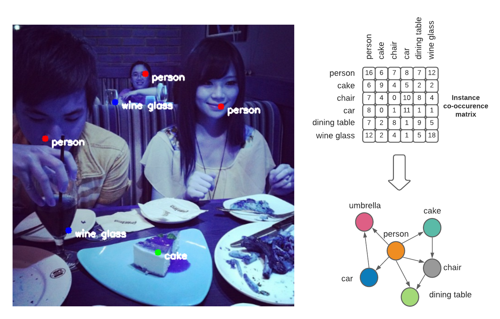

## GraphLOMO: LOcating Multiple Objects Without Visual Annotations <!-- omit in toc -->

Locating multiple objects has become an important task in multimedia research and applications due to the common nature of real-world images. Object localization requires a large number of visual annotations, such as bounding boxes or segmentation, but the annotation process is labour-intensive and sometimes inextricable for human experts in complex domains such as manufacturing and medical fields. Moving beyond single object localization, this paper presents a weakly semi-supervised learning framework based on Graph Transformer Networks using Class Activation Maps to LOcate Multiple Objects (GraphLOMO) in images without visual annotations. Our method overcomes the computational challenges of gradient-based CAM while integrating topological information and prior knowledge into object localization. Moreover, we investigate the higher order of object inter-dependencies with the use of 3D adjacency matrix for better performance. Extensive empirical experiments are conducted on MS-COCO and Pascal VOC to establish a suitable performance measure and baselines, as well as a state-of-the-art for weakly semi-supervised multi-object localization.

Source code for paper: [GraphLOMO: LOcating Multiple Objects Without Visual Annotations](https://link.springer.com/article/10.1007/s00138-025-01707-7)



## Table of contents <!-- omit in toc -->

- [Installation](#installation)
- [Training](#training)
- [Generate score maps](#generate-score-maps)
- [Evaluate the modified MaxBoxAccV2 for multiple objects](#evaluate-the-modified-maxboxaccv2-for-multiple-objects)
- [Generate center points from score maps](#generate-center-points-from-score-maps)
- [Evaluate the hit-mAP metric](#evaluate-the-hit-map-metric)
- [References](#references)

## Installation

    pip install -r requirements.txt
    pip install -e . # install this project

## Training

The training code is provided in `scripts/wsmol_train.py`

We provide training commands for the following architectures `vgg`, `efficientnet`, `resnet50`, `resnet101` and `resnext50` in combination with the following CAM methods `Grad-CAM`, `GCN`, `GTN`, `GTN + 3D adjacency matrices (Graph-CAM`).

```
python scripts/wsmol_train.py \
    --data-dir data/coco \
    --dataset coco \
    --metadata-dir metadata/coco \
    --image-size 448 \
    --workers 8 \
    --batch-size 80 \
    --lr 0.03 \
    --learning-rate-decay 0.1 \
    --epoch_step 100 \
    --embedding metadata/coco/embedding/coco_glove_word2vec_80x300.pkl \
    --adj-files \
        metadata/coco/topology/coco_adj.pkl \
        metadata/coco/topology/coco_adj_1_2.pkl \
        metadata/coco/topology/coco_adj_1_3.pkl \
        metadata/coco/topology/coco_adj_1_4.pkl \
        metadata/coco/topology/coco_adj_2_1.pkl \
        metadata/coco/topology/coco_adj_3_1.pkl \
        metadata/coco/topology/coco_adj_4_1.pkl \
    -a resnext50_32x4d_swsl \
    -g -gtn \
    --device_ids 0 1 \
    -n resnext50_swsl_gtn_1234432
```

For your convenience, we provided the pretrained models for both MS-COCO and Pascal VOC on [dropbox](https://www.dropbox.com/s/badai7hd5m274mt/checkpoints.zip?dl=0)

## Generate score maps

After training, the next step is generate score maps. Put the checkpoint obtained from step [4. Training](#4-training) into the folder `train_log/{experiment_name}`:

Refer to [training.xlsx](training.xlsx) for the list of checkpoints and the corresponding configuration used in our paper.

The following command generates score maps for our best Graph-CAM (GTN + 3D adjacency matrices) experiment on MS-COCO

```
python scripts/scoremap.py
    --dataset_name COCO
    --architecture resnext50gtn
    --experiment_name COCO_resnext50_swsl_gtn_1234432
    --wsol_method graph_cam
    --split val
    --batch_size 8
    --crop_size 448
    --adj-files
        metadata/COCO/topology/coco_adj.pkl
        metadata/COCO/topology/coco_adj_1_2.pkl
        metadata/COCO/topology/coco_adj_1_3.pkl
        metadata/COCO/topology/coco_adj_1_4.pkl
        metadata/COCO/topology/coco_adj_2_1.pkl
        metadata/COCO/topology/coco_adj_3_1.pkl
        metadata/COCO/topology/coco_adj_4_1.pkl
    --embedding metadata/COCO/embedding/coco_glove_word2vec_80x300.pkl
    --gtn
    --check_point coco_resnext50_swsl_gtn_1234432_86.9424.pth
```

The resulting score maps will be saved under `train_log/COCO_resnext50_swsl_gtn_1234432/scoremaps`

## Evaluate the modified MaxBoxAccV2 for multiple objects

To evaluate the modified MaxBoxAccV2 on the generated score maps, simply run `evaluation.py` and point to the score maps folder generated from step 5.

```
python scripts/evaluation.py
    --scoremap_root train_log/COCO_resnext50_swsl_gtn_1234432/scoremaps/
    --dataset_name VOC
    --split val
```

## Generate center points from score maps

Before evaluating `hit-mAP`, we need to generate center points using threshold [30, 50, 70] from the score maps obtained from step 5.

```
python scripts/scoremap_to_centers
    --experiment_name COCO_resnext50_swsl_gtn_1234432
    --threshold 30
```

## Evaluate the hit-mAP metric

The evaluation of hit-mAP for MS-COCO and Pascal VOC is done by `coco_evaluation_centers.py` and `voc_evaluation_centers.py` respectively. After generating center points in step 7, run the following command to evaluate hit-mAP

```
python scripts/coco_evaluation_centers.py
    --experiment_name COCO_resnext50_swsl_gtn_1234432
```

## References

- "Evaluating Weakly Supervised Object Localization Methods Right (CVPR 2020)" by Junsuk Choe, Seong Joon Oh, Seungho Lee, Sanghyuk Chun, Zeynep Akata, Hyunjung Shim. The original WSOL code can be found [here](https://github.com/clovaai/wsolevaluation)
